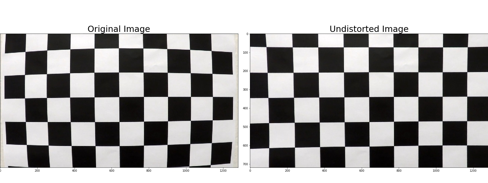
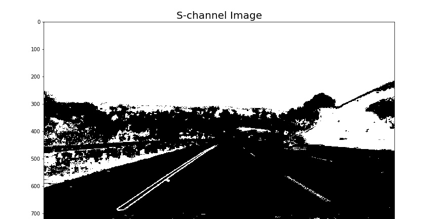
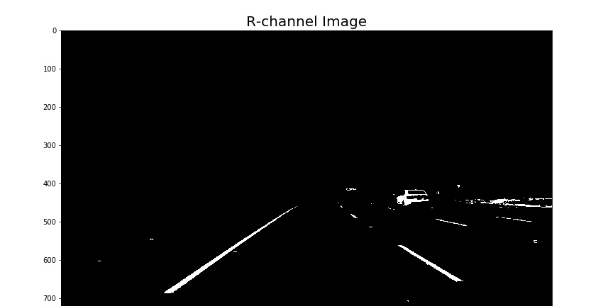
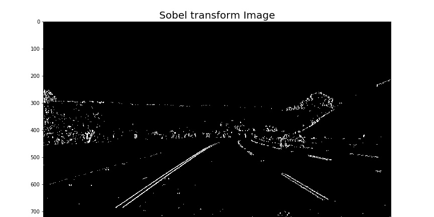
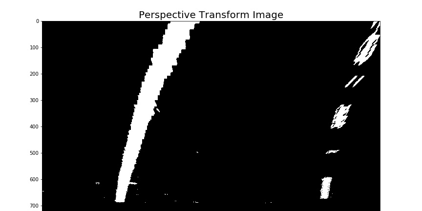
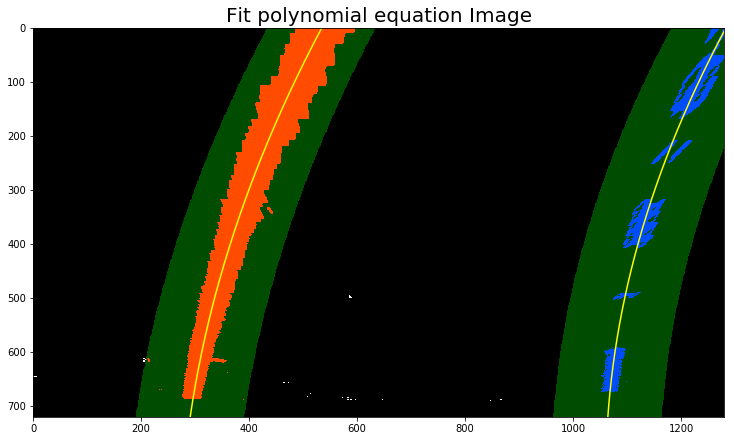
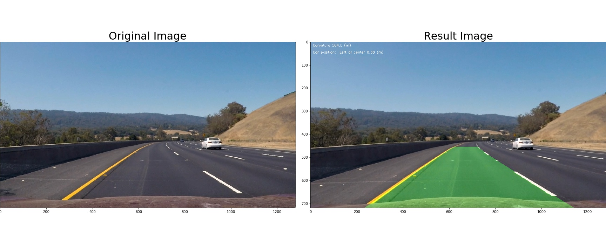

## Writeup Template

---

**Advanced Lane Finding Project**

The goals / steps of this project are the following:

* Compute the camera calibration matrix and distortion coefficients given a set of chessboard images.
* Apply a distortion correction to raw images.
* Use color transforms, gradients, etc., to create a thresholded binary image.
* Apply a perspective transform to rectify binary image ("birds-eye view").
* Detect lane pixels and fit to find the lane boundary.
* Determine the curvature of the lane and vehicle position with respect to center.
* Warp the detected lane boundaries back onto the original image.
* Output visual display of the lane boundaries and numerical estimation of lane curvature and vehicle position.

[//]: # (Image References)

[video1]: ./project_video_output.mp4 "Video"

## [Rubric](https://review.udacity.com/#!/rubrics/571/view) Points

### Here I will consider the rubric points individually and describe how I addressed each point in my implementation.  

---

### Writeup / README

### Camera Calibration

#### 1. Briefly state how you computed the camera matrix and distortion coefficients. Provide an example of a distortion corrected calibration image.

The code for this step is contained in the first cell of the IPython notebook located in [P4.ipynb](https://github.com/sandiptambde/CarND-Advanced-Lane-Lines/P4.ipynb).  

For calibration process we need to calculate camera matrix & distoration coefficients.
First we need to map corners in the 2D image i.e.Image points, to the 3D coordinates of the real undistorted corners i.e.object points 
I start by preparing "object points", which will be the (x, y, z) coordinates of the chessboard corners in the world. Here I am assuming the chessboard is fixed on the (9, 6) plane at z=0, such that the object points are the same for each calibration image.  Thus, `objp` is just a replicated array of coordinates, and `objpoints` will be appended with a copy of it every time I successfully detect all chessboard corners in a test image.  `imgpoints` will be appended with the (x, y) pixel position of each of the corners in the image plane with each successful chessboard detection.  

I then used the output `objpoints` and `imgpoints` to compute the camera calibration and distortion coefficients using the `cv2.calibrateCamera()` function.  I applied this distortion correction to the test image using the `cv2.undistort()` function and obtained this result: 

### Pipeline (single images)
Pipeline consists of following steps:
1. Undistortion
2. Create combined binary image by applying: 
	a. S-Channel filter
	b. R-Channel filter
	c. SobelX transform
3. Perspective transform
4. Histogram and calculating radius of curvature

Pipeline code is defined in IPython notebook cell-2 located in [P4.ipynb](https://github.com/sandiptambde/CarND-Advanced-Lane-Lines/P4.ipynb)

To demonstrate result of each step in the pipeline, I have applied it on below test image.

#### 1. Provide an example of a distortion-corrected image.

Please check below undistorted test image. Pay attension to corners of the image.
The code for distortion-corrected includes a function called `undistort()`. It uses `cv2.undistort()` api.

#### 2. Describe how (and identify where in your code) you used color transforms, gradients or other methods to create a thresholded binary image.  Provide an example of a binary image result.

I used a combination of colors and gradient thresholds to generate a binary image.  Here's an example of my output for this step. 

a. The code for S-Channel includes a function called `s_channel_binary()`. We extracts S-channel info from image by converting it to HSL form using `cv2.cvtColor(img, cv2.COLOR_RGB2HLS)`.

b. The code for R-Channel includes a function called `r_channel_binary()`. We extracts R-channel info from image by using `r_channel = img[:,:,0]`.

c. The code for Sobelx transform includes a function called `sobelx_transform()`. It uses `cv2.Sobel()` api.

d. The code for Combined Color channel and gradient thresholds includes a function called `binary_image()`. It creates combined image using by `combined_binary[(s_channel == 1) | (sobel_x == 1) | (r_channel == 1)] = 1`.

#### 3. Describe how (and identify where in your code) you performed a perspective transform and provide an example of a transformed image.

The code for my perspective transform includes a function called `perspective_transform()`. The function takes as inputs an image (`img`), as well as source (`src`) and destination (`dst`) points.  I chose the hardcode the source and destination points in the following manner:
It uses `cv2.getPerspectiveTransform(src,dst)` API

This resulted in the following source and destination points:

| Source        | Destination   | 
|:-------------:|:-------------:| 
| 270, 675      | 270, 675      | 
| 587, 455      | 270, 20       |
| 693, 455      | 1035, 20      |
| 1035, 675     | 1035, 675     |

I verified that my perspective transform was working as expected by drawing the `src` and `dst` points onto a test image and its warped counterpart to verify that the lines appear parallel in the warped image.

#### 4. Describe how (and identify where in your code) you identified lane-line pixels and fit their positions with a polynomial?

With perspective transform we get top view where our image will be undistorted.

To identify lane line pixels we apply histogram and find out where the pixels intensity is high. Then we slides window to find out other pixels that belongs to the left and right lanes. Please check `runpipeline()` function for implementation.

	`histogram = np.sum(binary_warped[binary_warped.shape[0]/2:,:], axis=0)`
	`leftx_current = np.int(np.mean(nonzerox[good_left_inds]))`
	`rightx_current = np.int(np.mean(nonzerox[good_right_inds]))`

Then I used the numpy function "polyfit" to fit a second order polynomial to left and right lane lines -
    
	`left_fit = np.polyfit(lefty, leftx, 2)`
    `right_fit = np.polyfit(righty, rightx, 2)`

Following is the result of the sliding window and poly fit - 

#### 5. Describe how (and identify where in your code) you calculated the radius of curvature of the lane and the position of the vehicle with respect to center.
a. Radius of curvature:

Once we have polynomial fit, we can calulate radius of curvature as(Taken from Measuring curvature class):
 	
	`y_eval = np.max(ploty)`
 	`right_curverad = ((1 + (2*right_fit_cr[0]*y_eval*ym_per_pix + right_fit_cr[1])**2)**1.5) / np.absolute(2*right_fit_cr[0])`
 	`left_curverad = ((1 + (2*left_fit_cr[0]*y_eval*ym_per_pix + left_fit_cr[1])**2)**1.5) / np.absolute(2*left_fit_cr[0])`

But this result is based on pixel values. We need to convert it to real world space.
For calculation, we considered once pixel as follows(in meters):
	
	`ym_per_pix = 30/720 # meters per pixel in y dimension`
	`xm_per_pix = 3.7/700 # meters per pixel in x dimension`

And converted radius of corvature in meters as follows:
	
	`left_curverad = ((1 + (2*left_fit_cr[0]*y_eval*ym_per_pix + left_fit_cr[1])**2)**1.5) / np.absolute(2*left_fit_cr[0])`
	`right_curverad = ((1 + (2*right_fit_cr[0]*y_eval*ym_per_pix + right_fit_cr[1])**2)**1.5) / np.absolute(2*right_fit_cr[0])`

The left and right lane radius were then averaged out compute the estimated radius of the lane curvature.

b. Car Position:

For Car position, I used the camera frame center as reference (since the camera is fixed on car). 
Then I computed the center of the lower section of lane by dividing x co-ordinate at 0th pixel of left and right lane from bottom. 
I computed these value from the generated poly line of second order and max y co-ordinate.

    `leftlanepoint = left_fit_cr[0]*imagey**2 + left_fit_cr[1]*imagey + left_fit[2]`
    `rightlanepoint = right_fit_cr[0]*imagey**2 + right_fit_cr[1]*imagey + right_fit_cr[2]`
    `lanecenter = ((leftlanepoint + rightlanepoint)/2)`
    `camcenter = (imagex/2)`
    `carpos =  (camcenter - lanecenter) * xm_per_pix`
	
Diffence between the frame center and the above point was used as a measure of car location in the lane.

Code is present in `runpipeline()` function
#### 6. Provide an example image of your result plotted back down onto the road such that the lane area is identified clearly.

I implemented this step in the function `runpipeline()`.  Here is an example of my result on a test image:

---

### Pipeline (video)

#### 1. Provide a link to your final video output.  Your pipeline should perform reasonably well on the entire project video (wobbly lines are ok but no catastrophic failures that would cause the car to drive off the road!).

Here's a [link to my video result](./project_video_output.mp4)

---

### Discussion

#### 1. Briefly discuss any problems / issues you faced in your implementation of this project.  Where will your pipeline likely fail?  What could you do to make it more robust?
I faced problems while selecting color transforms and gradients combinations as different colors, brightness are sensetive to filters we use.
Following are some secnarios: 
1. When we have simillar objects (e.g.cars- white & black) but different colors
2. When there is change in brightnes e.g. shadow vs bright scene
3. When other objects are close to our lane (Black car)

For above stated problems, combination of S-Channel + R-Channel + Sobelx tramsform worked well for me.

My pipeline is likely fail for shadow region.
To make it more robust, I think, I need to tweak filter threshold values. Also, need to consider adding/replacing current filter combination.
